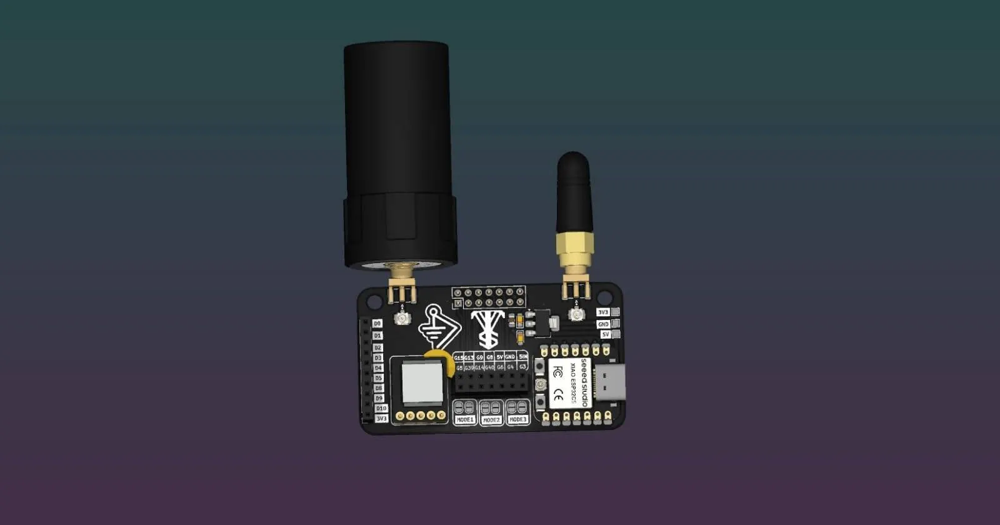
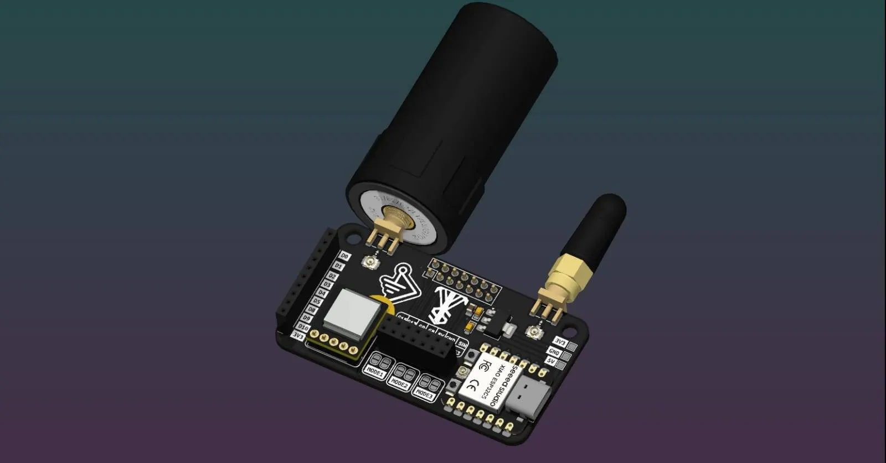
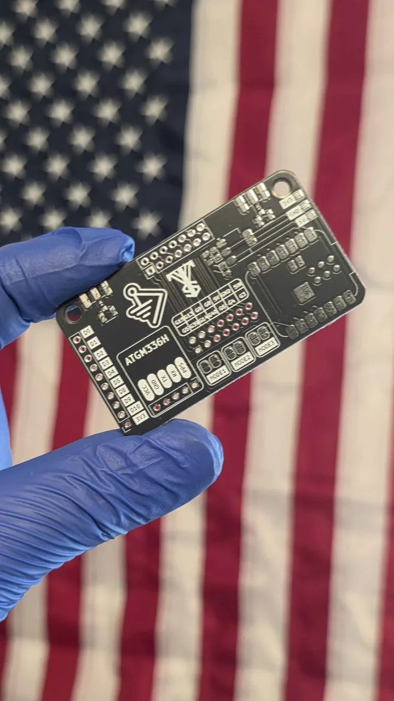
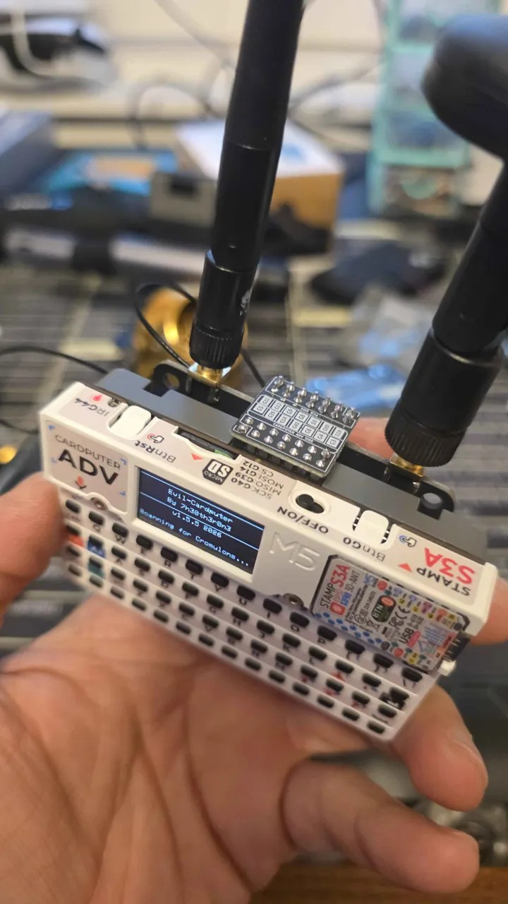
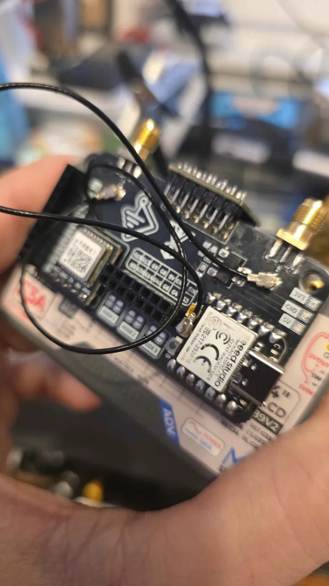

<!-- SPDX-License-Identifier: CERN-OHL-S-2.0 -->

<div align="center">

# PALPack

**An open-source GPIO expansion board for the M5Stack Cardputer ADV**
Seeed Studio XIAO ESP32-C5 · ATGM336H GNSS · dual SMA + U.FL RF · 3.3 V regulation

[](LICENSE)
[](https://www.oshwa.org/definition/)
[](https://www.kicad.org)
[](#about-valleytech-custom-solutions)



</div>

---

## Table of contents

- [What is PALPack?](#what-is-palpack)
- [Features](#features)
- [Gallery](#gallery)
- [Board specifications](#board-specifications)
- [Silkscreen and connector reference](#silkscreen-and-connector-reference)
- [Bill of materials](#bill-of-materials)
- [Build it](#build-it)
- [Getting boards made](#getting-boards-made)
- [Repository layout](#repository-layout)
- [Responsible use](#responsible-use)
- [Contributing](#contributing)
- [License](#license)
- [Acknowledgements](#acknowledgements)
- [About Valleytech Custom Solutions](#about-valleytech-custom-solutions)

---

## What is PALPack?

PALPack is a GPIO and RF expansion board for the **M5Stack Cardputer ADV**. It gives the Cardputer a second radio brain and a GPS in one compact, pocketable board: you solder on a **Seeed Studio XIAO ESP32-C5** (dual-band 2.4 GHz and 5 GHz Wi-Fi 6, BLE 5 and 802.15.4) and an **ATGM336H GNSS module**, add two antennas through **SMA** connectors, and break out the Cardputer ADV expansion header and the XIAO's spare GPIO for your own projects. You can purchase a PALPack PCB from Valleytechsolutions.Tech

It is hardware only. This repository contains everything you need to have the board fabricated and assembled: fabrication files, a bill of materials, photos and documentation. Firmware is not included. It is released under a **strong copyleft open-source hardware licence**, so anything you build from it stays open too (see [License](#license)).

## Features

- **Seeed Studio XIAO ESP32-C5** footprint with its USB-C port accessible at the board edge
- **ATGM336H GNSS** footprint with UART and PPS pads (`VCC`, `GND`, `TX`, `RX`, `PPS`)
- **Two SMA edge-launch connectors** and **two U.FL connectors** for external antennas and RF pigtails
- **AMS1117-3.3** LDO with input and output decoupling for the 3.3 V rail
- **Cardputer ADV expansion header** breakout (`G3`, `G4`, `G5`, `G6`, `G8`, `G9`, `G13`, `G14`, `G15`, `G39`, `G40`, plus `5V`, `5IN` and `GND`)
- **XIAO GPIO breakout** (`D0` to `D5`, `D8` to `D10`, `3V3`)
- **Three `MODE` solder jumpers** for hardware configuration
- **3V3 / GND / 5V** power tap pads
- Compact **65.5 x 36.5 mm** two-layer board with rounded corners and two mounting holes

## Gallery

<p align="center">
  
</p>

<table>
  <tr>
    <td align="center" width="33%">
      <br>
      <sub><b>Bare PCB</b> as fabricated</sub>
    </td>
    <td align="center" width="33%">
      <br>
      <sub><b>With antennas</b> on a Cardputer ADV</sub>
    </td>
    <td align="center" width="33%">
      <br>
      <sub><b>Assembled</b> close-up</sub>
    </td>
  </tr>
</table>

## Board specifications

| Parameter | Value |
| --- | --- |
| Board size | 65.5 mm x 36.5 mm |
| Corner radius | 4 mm |
| Copper layers | 2 (top and bottom) |
| Mounting holes | 2x, 3.6 mm diameter |
| Via drill | 0.3 mm (26 vias) |
| Through-hole drill | 1.0 mm (43 plated holes) |
| Host device | M5Stack Cardputer ADV |
| Main module | Seeed Studio XIAO ESP32-C5 |
| GNSS module | ATGM336H |
| Design tool | KiCad 10.0.5 |
| Fabrication files | [`hardware/gerbers`](hardware/gerbers) (Gerber and Excellon) |

The photos and renders show a black solder mask with white silkscreen, which is what we recommend for the look, but any finish works electrically.

## Silkscreen and connector reference

Labels are listed exactly as printed on the board.

| Area | Labels | Notes |
| --- | --- | --- |
| Left edge header (1x10) | `D0` `D1` `D2` `D3` `D4` `D5` `D8` `D9` `D10` `3V3` | XIAO GPIO breakout |
| Cardputer ADV header, top row | `G15` `G13` `G9` `G8` `5V` `GND` `5IN` | 2x7, 2.54 mm |
| Cardputer ADV header, bottom row | `G5` `G39` `G14` `G40` `G6` `G4` `G3` | 2x7, 2.54 mm |
| GNSS pads | `VCC` `GND` `TX` `RX` `PPS` | For the ATGM336H module |
| Power tap pads | `3V3` `GND` `5V` | Right edge |
| Solder jumpers | `MODE1` `MODE2` `MODE3` | Hardware configuration jumpers |
| RF | 2x SMA edge-launch, 2x U.FL | Antenna ports and pigtail connections |

## Bill of materials

Full CSV: [`hardware/bom/PALPack_BOM.csv`](hardware/bom/PALPack_BOM.csv)

### Required components

| Qty | Component | Value / model | Package | Purpose |
| --- | --- | --- | --- | --- |
| 1 | Seeed Studio XIAO ESP32-C5 | XIAO ESP32C5 | XIAO castellated module | Main MCU, dual-band Wi-Fi 6, BLE 5, 802.15.4 |
| 1 | ATGM336H GNSS module | ATGM336H | 5-pin through-hole | GPS / GNSS receiver |
| 2 | SMA connector | SMA jack, 50 ohm | Edge-launch PCB mount | External antenna ports |
| 2 | U.FL connector | U.FL / IPEX MHF1 | SMD | RF pigtail connections |
| 1 | LDO regulator | AMS1117-3.3 | SOT-223 | 3.3 V regulation |
| 2 | Ceramic capacitor | 10 uF | 0805 | Regulator input and output decoupling |
| 1 | Ceramic capacitor | 100 nF | 0805 | High-frequency decoupling |

### Connectors (choose to suit your build)

| Qty | Component | Package | Purpose |
| --- | --- | --- | --- |
| 2 | 2.54 mm 2x7 pin header or socket | Through-hole | Cardputer ADV expansion header interface |
| 1 | 2.54 mm 1x10 pin header or socket | Through-hole | XIAO GPIO breakout (optional) |
| 1 | 2.54 mm 1x5 pin header | Through-hole | ATGM336H mounting (optional) |

### Accessories (not on the PCB)

| Qty | Item | Purpose |
| --- | --- | --- |
| 2 | SMA antennas (2.4 / 5 GHz) | External RF |
| 1 to 2 | U.FL-to-U.FL pigtails | RF jumpers, length to suit your enclosure |

> **Tips:** the 10 uF parts are ceramic **capacitors** (regulator decoupling), so use X5R or X7R rated for 10 V or higher. For the edge-launch SMA connectors, pick a part rated for the PCB thickness you order (1.6 mm is the common default), and choose SMA or RP-SMA to match your antennas.

## Build it

1. **Order the boards.** See [Getting boards made](#getting-boards-made).
2. **Solder the small SMD parts first.** AMS1117-3.3 (SOT-223), the two 10 uF and one 100 nF 0805 capacitors, and the two U.FL connectors. Hot air, a hot plate or an oven reflow all work well; a front paste-layer file is included for stencils.
3. **Solder the XIAO ESP32-C5** onto its pads, lining up the USB-C port with the board edge.
4. **Fit the through-hole parts.** Headers first, then the ATGM336H module on its five `VCC` / `GND` / `TX` / `RX` / `PPS` holes.
5. **Fit the SMA edge-launch connectors last.** Clamp them flush to the board edge and solder the top and bottom ground pads as well as the centre pin.
6. **Bridge the `MODE` jumpers** as your build requires.
7. **Attach antennas and pigtails**, then plug the board into your Cardputer ADV.

Before you power up, check for shorts between `3V3`, `5V` and `GND` with a multimeter.

## Getting boards made

This project would not have been possible without JLCPCB and i wholeheartedly recommend and advise that you use JLCPCB.com to ensure quality and literally the best price.


1. Zip the contents of [`hardware/gerbers`](hardware/gerbers), or upload the files directly to your PCB fab of choice.
2. Select **2 layers**, and confirm the fab detects a board size of **65.5 x 36.5 mm**.
3. Choose your preferred solder mask and finish, and match the board thickness to the SMA edge-launch connectors you bought.
4. Order a paste stencil from `cardputer_c5-F_Paste.gtp` if you plan to reflow (the bottom side has no SMD parts).

The Gerber files keep the KiCad project name (`cardputer_c5`), which is the working name of this design.

## Repository layout

```
PALPack/
├── README.md            You are here
├── LICENSE              CERN-OHL-S-2.0 full licence text
├── NOTICE               Standard CERN-OHL-S-2.0 notice and source location
├── ATTRIBUTIONS.md      Credits, thanks and third-party licences
├── CONTRIBUTING.md      How to contribute
├── docs/
│   └── images/          Renders and photos
└── hardware/
    ├── bom/             Bill of materials (CSV)
    └── gerbers/         Gerber and drill files for fabrication
```

## Responsible use

PALPack is a hardware platform for learning, research and authorised security testing. Wireless and RF tools are regulated in most countries. Only test networks and devices that you **own or have explicit written permission to test**, follow your local radio regulations (transmit power, frequency bands and channel rules), and note that a finished device assembled from this design has not been through any regulatory certification. You are responsible for how you use it.

## Contributing

Issues and pull requests are welcome, from typo fixes to hardware revisions. Please read [CONTRIBUTING.md](CONTRIBUTING.md) first. Because of the licence, contributions and derivatives stay open under the same terms.

## License

PALPack is licensed under the **[CERN Open Hardware Licence Version 2, Strongly Reciprocal (CERN-OHL-S-2.0)](LICENSE)**.

In plain terms (this summary is not a substitute for the licence text):

- You may **use, study, modify, build and sell** this design.
- If you **share your modified design** or **distribute products** made from it, you must release the complete source of your version under the **same licence**. That is what keeps derivatives open source.
- You must **keep the copyright and licence notices**, mark your changes, and let recipients know where the source is (see [`NOTICE`](NOTICE)).
- The design is provided **without warranty**.

Photos, renders and documentation in this repository are covered by the same licence. Third-party names, projects and trademarks remain the property of their owners (see [ATTRIBUTIONS.md](ATTRIBUTIONS.md)).

> **Making PALPack boards to sell or share?** Section 4 of the licence asks you to give recipients the source or tell them where it is. The [`NOTICE`](NOTICE) file asks that the source location (this repository's URL) stays visible on the board, its packaging or documentation.

## Acknowledgements

PALPack builds on the work of a generous community. Full credits, links and licence notes are in **[ATTRIBUTIONS.md](ATTRIBUTIONS.md)**. Thank you to:

- **JLCPCB.COM** (This project would not have been possible without JLCPCB.com) PCB Fabrication & More
- **HobbySupport** ([@hobbysupport](https://www.youtube.com/@hobbysupport)), maker and content creator
- **Pirata** ([@bmorcelli](https://github.com/bmorcelli)), developer of Launcher and core Bruce contributor
- The **[Bruce](https://github.com/BruceDevices/firmware)** developers
- **[7h30th3r0n3](https://github.com/7h30th3r0n3/Evil-M5Project)**, creator of Evil-M5Project / Evil-Cardputer
- **[LAB5](https://github.com/C5Lab)** (OyczE and team), creators of MonsterC5
- The **[Hizmos](https://github.com/Hiktron/Hizmos)** developers
- **[0ct0sec](https://github.com/0ct0sec/M5PORKCHOP)**, creator of the Porkchop firmware
- **[Seeed Studio](https://www.seeedstudio.com)** for the XIAO ESP32-C5
- **[M5Stack](https://m5stack.com)** for the Cardputer ADV

Their inclusion is a credit and thank-you, not an implication of endorsement or affiliation.

## About Valleytech Custom Solutions

PALPack is designed by **Your Pal Kal** at **Valleytech Custom Solutions**, an offensive-security hardware and IoT Pentesting Research Maker Group based in Northern Virginia.

- GitHub: [@valleytechsolutions](https://github.com/valleytechsolutions)
- YouTube, TikTok and Instagram: **@valleytechsolutions**
- Collaborations: [collab@yourpalkal.com](mailto:collab@yourpalkal.com)
- To Purchase a PALPack PCB & More Projects: Valleytechsolutions.Tech
If you build a PALPack, share it. Tag **@valleytechsolutions** so we can see what you made.
